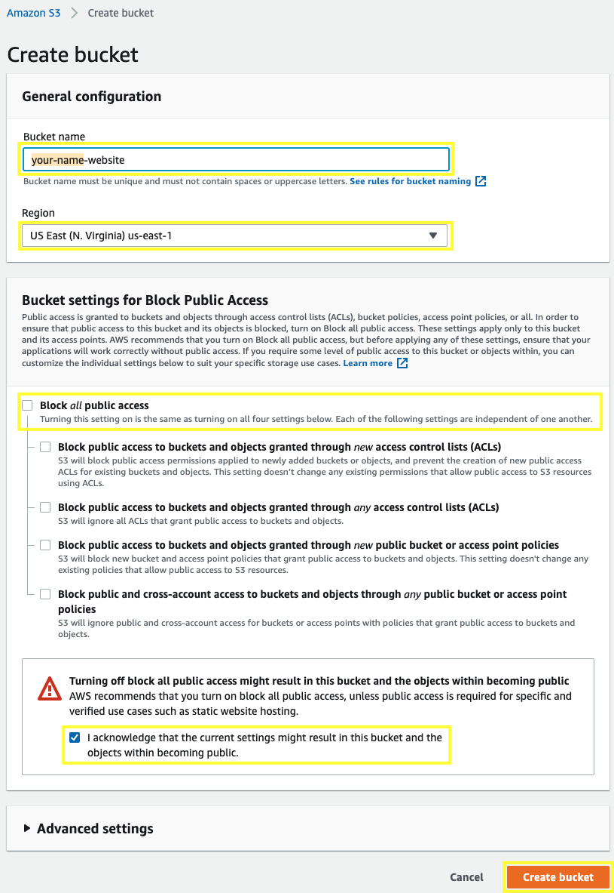
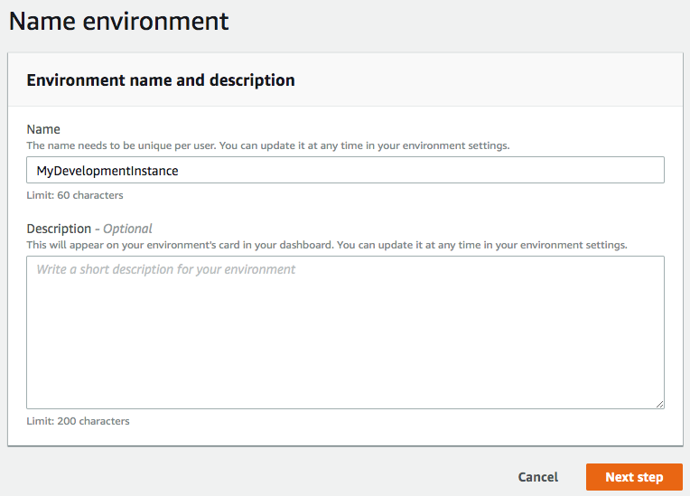
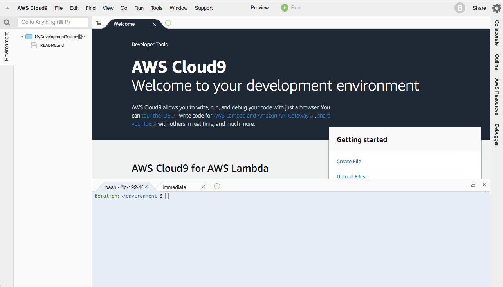
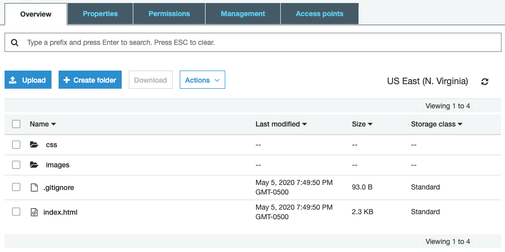
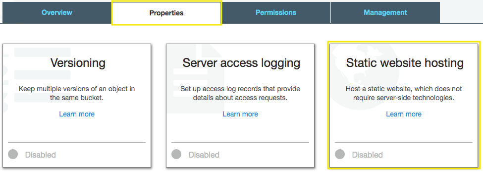
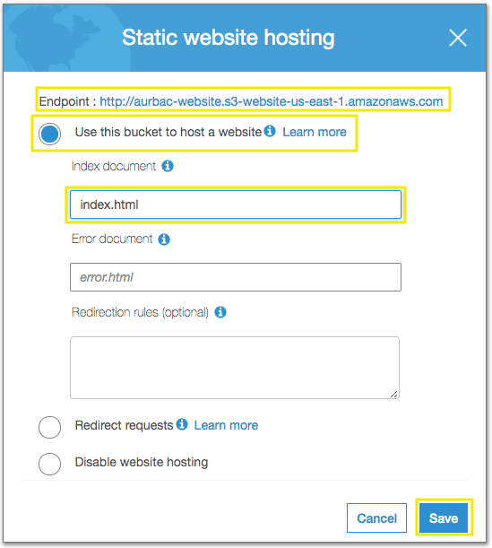

# Publish a Static WebSite with Amazon S3

[!embed?max_width=1200](https://www.youtube.com/watch?v=_I14_sXHO8U)

[Amazon Simple Storage Service](https://aws.amazon.com/s3/) is storage for the Internet. It is designed to make web-scale computing easier for developers and also you can host a Static Website in an Amazon S3 bucket.

## 1. Create an Amazon S3 bucket

1.1\. Open the Amazon S3 console at https://console.aws.amazon.com/s3/.

1.2\. Choose **Create bucket**.


1.3\. In the **Bucket name** field, type a unique DNS-compliant name for your new bucket, for example `<your-name>-website`.

* The name must be unique across all existing bucket names in Amazon S3.
* After you create the bucket you cannot change the name, so choose wisely.
* Choose a bucket name that reflects the objects in the bucket because the bucket name is visible in the URL that points to the objects that you're going to put in your bucket.

1.4\. For **Region**, choose **US East (N. Virginia)** as the region where you want the bucket to reside.

1.5\. For **Bucket settings for Block Public Access**, uncheck **Block all public access**.

1.6\. Validate the configurations, check **I acknowledge...**  and choose **Create bucket**.



## 2. Create a Cloud9 instance to upload your static Website

[AWS Cloud9](https://aws.amazon.com/cloud9/) is a cloud-based integrated development environment (IDE) that lets you write, run, and debug your code with just a browser. It combines the rich code editing features of an IDE such as code completion, hinting, and step-through debugging, with access to a full Linux server for running and storing code.

2.1\. Open the AWS Cloud9 console at https://console.aws.amazon.com/cloud9/.

2.2\. Click on **Create environment**.


2.3\. For the **Name** type `MyDevelopmentInstance`, and choose **Next step**.



2.4\. For the **Environment settings** use the default values and choose **Next step**.

2.5\. Click on **Create environment**.

2.6\. Wait some seconds until your development environment is ready, you will see the following screen.



2.7\. Inside the bash terminal execute the following commands:

* Download static website from github.
```console
git clone https://github.com/aurbac/static-website.git
```
* Upload static website, change **`<your-name>-website`** with your bucket name.
```console
aws s3 cp static-website/ s3://<your-name>-website/ --recursive --exclude ".git/*" --acl public-read
```

2.8\. Open the Amazon S3 console at https://console.aws.amazon.com/s3/, open your Amazon S3 bucket, you will see the files uploaded.



## 3. Configure the S3 bucket for static website hosting

3.1\. Inside your Amazon S3 bucket, choose **Properties**.


3.2\. Choose **Static website hosting**.



3.3\. Choose **Use this bucket to host a website** and for **Index document** type `index.html`, copy the **Endpoint** and click **Save**.



3.4\. Open a new browser tab and browse the static website by entering the Endpoint copied. You should see a website that looks like the following:


**Great Job! You have deployed a static website!!**