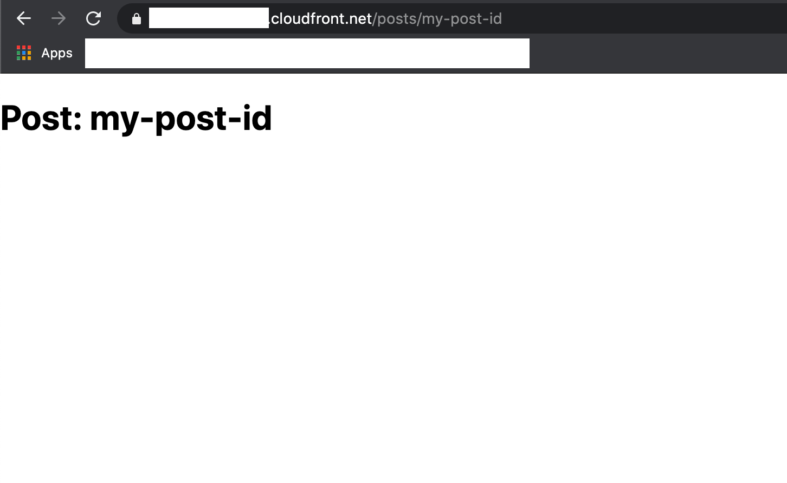

# Dynamic Routes

Add a new folder under the **pages** directory called **posts**. Here create a new file named **[id].js** and add the following code to the file:

```js
import { useRouter } from 'next/router'

const Post = () => {
    const router = useRouter()
    const { id } = router.query

    return <h1>Post: {id} </h1>
}

export default Post
```

Deploy again using the serverless command:

```bash
$ npx serverless
```

Once deployed go to the browser and append **/posts/** my-post-d to the cloudfront url. This should opena  page through the dynamic route showing the post id as the heading.

