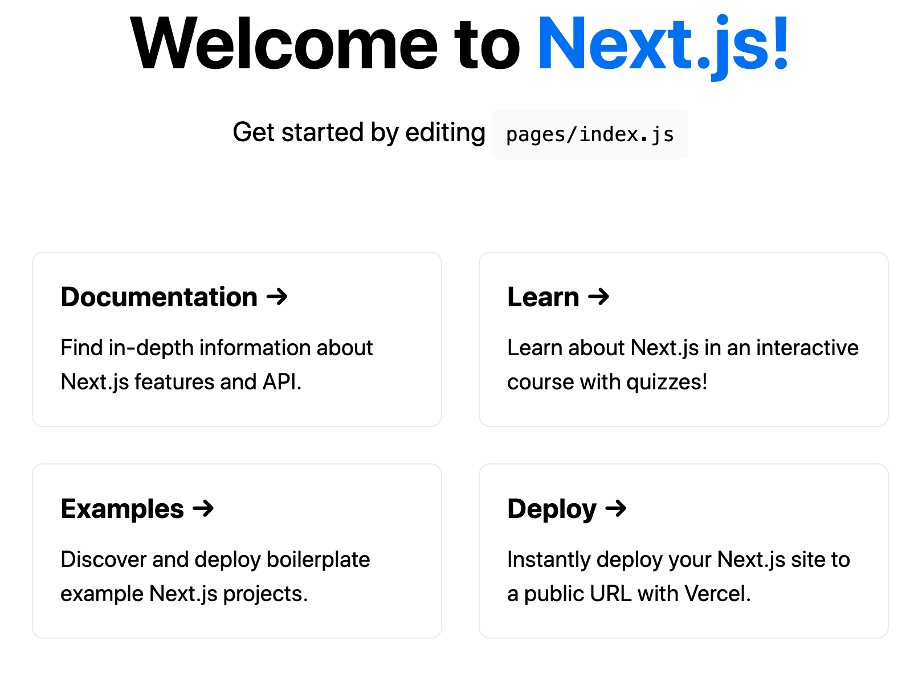

# First Deployment

Open the serverless.yml file and clear the contents.

Add the following 2 lines to the file instead:

```yml
myNextApp:
  component: "@sls-next/serverless-component@1.18.0"
```

In the above step you are adding the [Serverless Next.js Component](https://github.com/serverless-nextjs/serverless-next.js). Sane defaults are baked in, so no additional configuration is needed.

Use the Serverless Framework to deploy via the serverless command, like this:

```bash
$ npx serverless
```

On successful deployment you will see an output as so

```bash
  myNextApp: 
    appUrl:         https://abcdxyz1234.cloudfront.net
    bucketName:     abcdxy-apv99zz
    distributionId: XDISWPMRM
```
Open the URL in our browser tab to see the Next.js home page.


